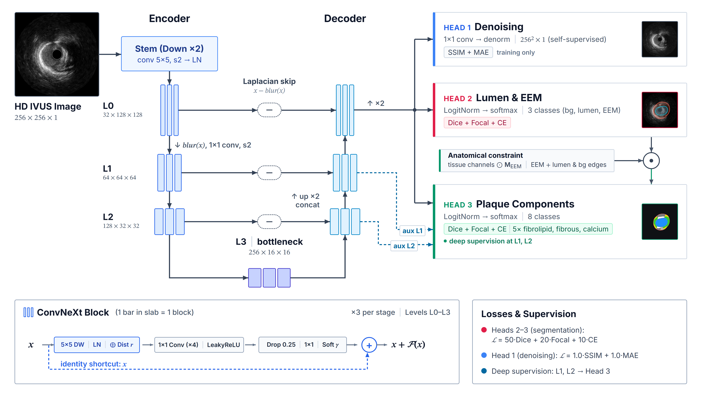

At the **Center for Digital Cardiovascular Innovations**, University of Miami Miller School of Medicine / UHealth System (**June 2026 – Present**; directed by **Dr. Yiannis S. Chatzizisis**, Chief, Division of Cardiovascular Medicine), this research develops multimodal deep learning and **agentic clinical decision support systems (CDSS)** to empower interventional cardiologists before and during complex percutaneous coronary interventions (PCI).

## Multimodal Image Analysis: IVUS, OCT & Angiography

Effective clinical decision-making requires cross-scale structural awareness—from macroscopic vascular architecture to microscopic plaque vulnerability:

- **High-Definition IVUS (HD-IVUS & NIRS-IVUS)**: Deep multi-task ConvNeXt-U-Net networks segmenting lumen, vessel wall (external elastic membrane), and plaque composition (calcium, fibrous, fibrolipidic) across 40,000+ expert-annotated IVUS frames.
- **Intracoronary Optical Coherence Tomography (OCT)**: High-resolution (10–15 µm) optical profiling capturing thin-cap fibroatheromas (TCFA), macrophage infiltration, and acute post-stent malapposition.
- **X-Ray Coronary Angiography (Luminography & QCA)**: Macroscopic vessel roadmapping, bifurcation anatomy tracking, and automated co-registration with pullback cross-sections.

*Figure: Multitask ConvNeXt-U-Net architecture with multi-resolution stages (L0–L3) and specialized heads for radial-distance-weighted denoising, lumen/EEM boundary delineation, and plaque tissue characterization.*

## Agentic Clinical Decision Support System (CDSS)

By orchestrating autonomous multi-agent reasoning over co-registered IVUS, OCT, and Angiographic streams, the CDSS moves beyond passive segmentation toward active procedural guidance:

- **Automated Calcium Phenotyping**: Quantitative assessment of calcium arc, longitudinal length, and radial depth to compute standardized calcium fracture risk scores.
- **Agentic Procedural Triage**: Autonomously recommends optimal lesion preparation strategies—selecting among non-compliant balloons, intravascular lithotripsy (IVL), rotational/orbital atherectomy, or cutting balloons based on individualized lesion mechanics.
- **Virtual Stenting & Stent Under-Expansion Prediction**: Integrates finite element analysis (FEA) and learned surrogate models across 1,200 lesion phenotypes to forecast stent expansion and mitigate adverse cardiac events (restenosis, thrombosis).

## Related Manuscripts & Clinical Studies

- **Deep Learning Model for Multi-Class Segmentation of High-Definition Intravascular Ultrasound** — Under review at *Scientific Reports* (2026)
- **Head-to-Head Comparison of Coronary Artery Bifurcation Stenting Strategies: A Virtual Clinical Study** — Under review at *JACC: Cardiovascular Interventions* (2026)
- **Head-to-Head Comparison of Latest Intracoronary Imaging Modalities** — Submitted to *JACC: Cardiovascular Interventions* (2026)
