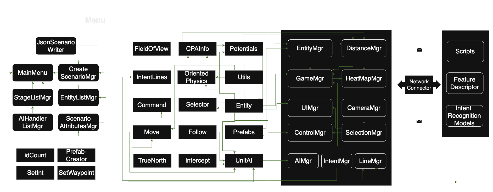
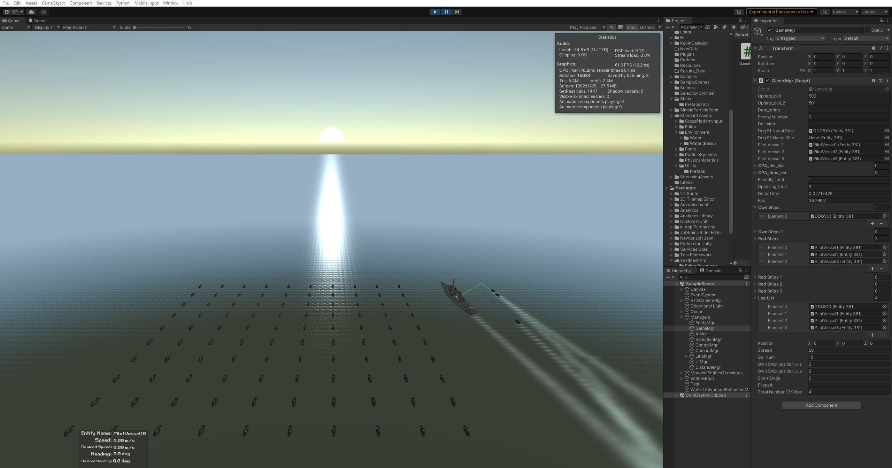

**NavySim: Multi-Vessel Simulation Engine (2022–2026)** is an advanced serious-game simulation and analysis platform built in Unity for naval autonomy research, developed across Md Abu Sayed's doctoral work funded by the Office of Naval Research (ONR).

## System Architecture & Key Capabilities

- **Modular System Architecture**: Features decoupled subsystem managers (Scenario Manager, Agent Manager, Physics Engine, Threat Evaluation, and Sensor/Weapon Managers) facilitating rapid scenario prototyping and benchmarking.
- **Physics-Consistent Multi-Agent Scenarios**: Supports heterogeneous surface vessels with configurable hydrodynamics, COLREGS-compliant collision avoidance (VOCCA), sensing envelopes, and defensive suites.
- **Dynamic Threat & Vulnerability Surfaces**: Real-time shader pipeline calculates Closest Point of Approach (CPA/TCPA), sensor blindness zones, and weapon coverage to render unified threat surfaces.
- **Integrated Machine Learning Loop**: Connects external PyTorch and statistical intent models (HMMs, LSTMs, Transformers, MTITP GANs) via high-throughput TCP streaming for real-time tactical decision support.
- **Industry & Academic Deployment**: Validated in collaboration with naval researchers and industry partners (Huntington Ingalls Industries) for autonomous vessel interaction analysis.

*Figure: High-level modular architecture of NavySim 2.0 (IEEE Transactions on Games 2026), detailing decoupled Scenario, Physics, Agent, and Threat Evaluation subsystems with high-throughput ML bridge.*

*Figure: Multi-vessel tactical encounter in NavySim demonstrating physics-based ship maneuver dynamics, sensor coverage, and live threat calculation.*

## Related Publications

- **NavySim 2.0: Enhanced Multi-Vessel Simulation and Analysis Engine for Advanced Naval Research** — *IEEE Transactions on Games* (2026) · [IEEE Xplore (Document: 11593091)](https://ieeexplore.ieee.org/abstract/document/11593091)
- **NavySim: A Multi-Vessel Simulation and Analysis Engine for Naval Domains** — *IEEE Conference on Games (CoG)* 2024 · [IEEE Xplore (DOI: 10.1109/CoG60054.2024.10645561)](https://ieeexplore.ieee.org/abstract/document/10645561)
